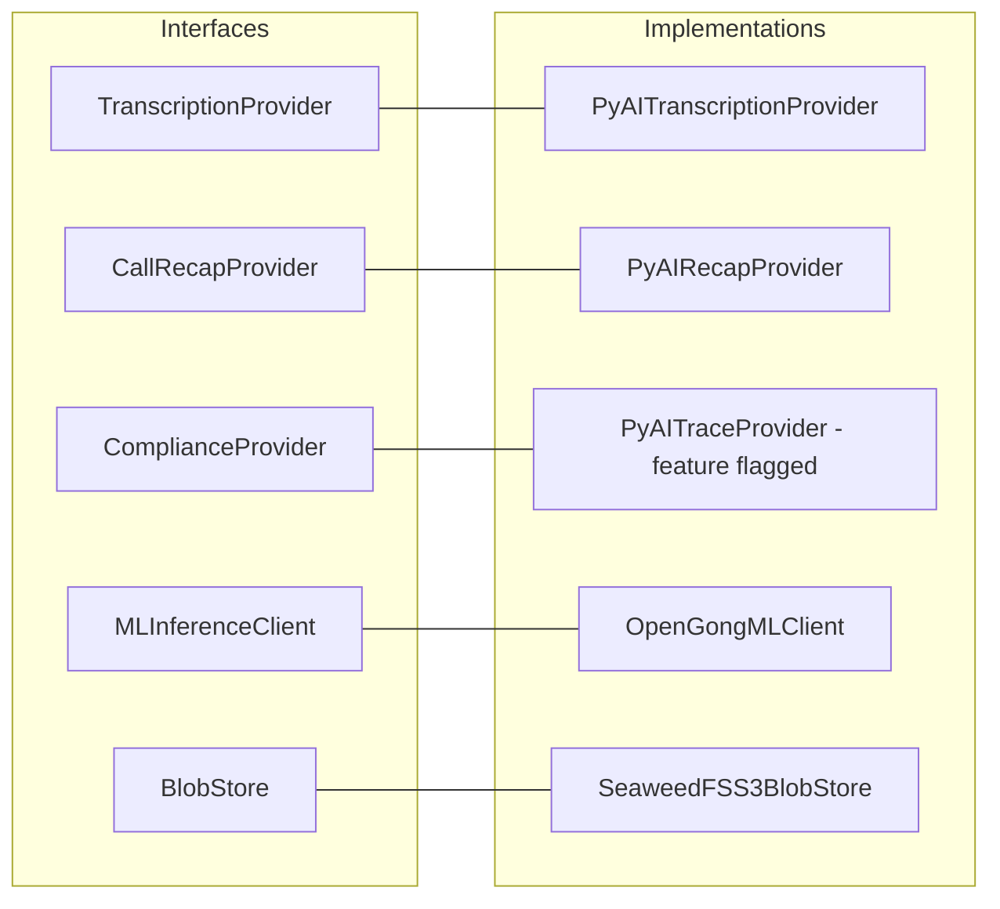
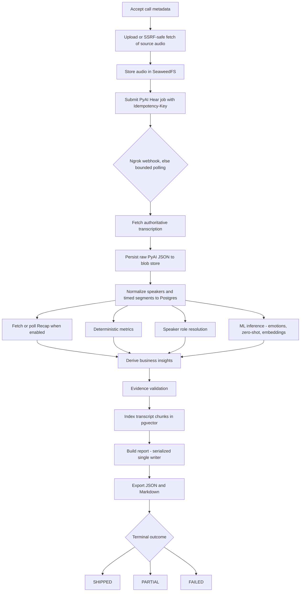

# OpenGong — Architecture Reference (`open-gong-api`)

> Single source of truth for what we are building, why, and how the pieces fit together.
> Validated against the original hackathon design discussion (ChatGPT export) on 2026-08-13.

---

## 1. What We Are Building

**OpenGong** is an open-source, Gong-style sales-call intelligence product.

A user uploads a call recording (or supplies an HTTPS recording URL). The system produces a
complete, evidence-backed call report: diarized transcript, summaries, deal insights, coaching,
follow-up email, and a queryable call memory — where **every factual claim is provably tied to
the transcript**.

### The Central Product Invariant

> **"NO PROOF IN THE TRANSCRIPT, NO CLAIM IN THE REPORT."**

- Every factual insight must reference one or more **real transcript segment IDs**.
- We **never store or display an LLM-generated quote** — displayed quotes are always loaded
  directly from stored transcript segments.
- The model may *infer*; the **evidence layer decides whether the inference ships**.
- Unsupported claims are dropped or marked `UNCONFIRMED` — never retried until they pass.
- Absence-based risks (e.g. "no timeline mentioned") are explicitly marked `ABSENCE_BASED`.

### The Demo Story

Upload call → AI produces the report → *"but summaries hallucinate"* → click any claim →
**hear the customer actually say it** → show Reality Check (rep-said vs customer-said) →
surface something the salesperson missed → show the Next Call Battlecard → generate a
follow-up email that **refuses to include unsupported commitments**.

### The Anti-Feature

We never show a fake close probability ("84% likely to close"). We show **observable deal
signal dimensions** instead: pain identified, business impact, timeline, economic buyer,
decision maker, next meeting committed, competitor active, blocker active.

---

## 2. Feature Set

### Core

| Feature | How it's built |
|---|---|
| Diarized transcript | PyAI Hear (mono diarization or stereo channel split) |
| Speaker roles and names | Heuristics + ML classification, manual override via API |
| Headline / summary / decisions / action items / next steps | PyAI Recap (normalized), ML generation fallback |
| Talk ratio, longest monologue, question rate | Deterministic Python from segment timestamps |
| Keyword and competitor mentions | Tracked terms + alias matching + zero-shot labels |

### High-Impact

| Feature | Essence |
|---|---|
| Customer Truth | Only what the **customer** actually said, categorized (pain, requirement, buying signal, blocker, budget, timeline, competition, commitment), each with exact quote + timestamps |
| Evidence receipts + click-to-play audio | Every insight carries segment IDs and `start_ms`/`end_ms`; UI seeks into original audio (no clip pre-generation) |
| Buyer emotion timeline | GoEmotions on customer segments → valence timeline. Explicitly **not** buying intent |
| Buying-intent signals | Observable dimensions, never a probability |
| Objections + coaching | Zero-shot detection (pricing, security, technical, budget, timing, integration, competition) + deterministic playbook responses |
| Reality Check | Rep-said vs customer-said mismatches with severity + deterministic reason codes |
| Commitment Ledger | Seller commitments / customer commitments / uncommitted next steps, with owner, action, due text, evidence |
| Deal Killers | Observable rules only (security blocker, budget blocker, active competitor, no timeline, no economic buyer, no next meeting, explicit rejection, technical blocker); statuses `SUPPORTED` / `ABSENCE_BASED` / `UNCONFIRMED` |
| Competitor intelligence | Name, mention context, customer position, evidence |
| Moments That Mattered | Normalized timestamped markers for UI timeline |
| Next Call Battlecard | Deterministic template from validated data; optional generation may polish wording but never add facts |
| Manager Brief | Pure template over existing validated insights — no model call |
| Evidence-safe follow-up email | Sentence objects `{text, evidence_segment_ids, supported}`; courtesy text marked `NON_FACTUAL`; polish must preserve sentence count + evidence mapping or fall back |
| Ask-the-Call | BGE embeddings + pgvector top-K retrieval; optional FLAN-T5 synthesis that must retain retrieved segment IDs; retrieval-only fallback is valid |
| Export + sharing | JSON and Markdown export; hashed, expiring, revocable read-only share tokens |

---

## 3. System Architecture

### Where `open-gong-api` fits in the overall product


### Repo boundaries

| Repo | Responsibility |
|---|---|
| `open-gong-api` (**this repo**) | FastAPI backend, Celery pipeline, data model, PyAI + ML clients, evidence validation, reports, exports, sharing |
| `open-gong-web` | React + Tailwind UI (upload, report, audio player, evidence UI) |
| `open-gong-ml` | Hosted ONNX inference service: GoEmotions, ModernBERT zero-shot, BGE-small embeddings, optional FLAN-T5 |

### Model / responsibility split (final, post-Qwen decision)

The original design used a local Qwen3-4B LLM via llama.cpp. That was **rejected** — too slow
for a hosted demo on modest hardware. The final design uses PyAI for speech, small OSS
specialist models served by `open-gong-ml`, and deterministic rules — a general-purpose LLM
is *not* required for most features.

| Requirement | Implementation |
|---|---|
| STT + diarization + timestamps | PyAI Hear |
| Call summary / recap | PyAI Recap (pack `sales_outbound`) |
| Emotions | `SamLowe/roberta-base-go_emotions` (via open-gong-ml) |
| Sales semantics (zero-shot) | `MoritzLaurer/ModernBERT-base-zeroshot-v2.0`, INT8 ONNX (via open-gong-ml) |
| Embeddings | `BAAI/bge-small-en-v1.5` → 384-dim → pgvector (via open-gong-ml) |
| Optional generation (polish, Ask synthesis) | `google/flan-t5-small` (swappable to base, via open-gong-ml) |
| Talk ratio / monologue / questions / keywords | Deterministic Python |
| Evidence validation | Deterministic Python |
| Blob storage | SeaweedFS (S3-compatible API via boto3) |
| Database | PostgreSQL + pgvector |
| Queue / results | Valkey (Celery broker + result backend) |

**Forbidden:** OpenAI, Anthropic, Gemini, Cohere, Replicate, Hugging Face hosted inference, or
any other paid AI provider.

### Provider boundaries (architectural rule)



- **Only** `app/providers/pyai/` may know PyAI response shapes. All PyAI output is normalized
  (e.g. `NormalizedTranscript`, `NormalizedRecap`) before the intelligence pipeline sees it.
- **Only** the blob-store implementation may know boto3/S3 details.
- Trace is interface + client only, behind `PYAI_TRACE_ENABLED`; P0 never blocks on it.

---

## 4. End-to-End Pipeline



- The pipeline is **idempotent** end to end (stable logical idempotency keys, Celery
  `acks_late`, task idempotency).
- Independent analysis (metrics, emotions, labels, embeddings) fans out **in parallel** after
  transcript persistence.
- Anything writing final report state is **serialized** through a single finalizer task.
- Recap failure never deletes a successful transcript → the run ends `PARTIAL`, not `FAILED`.

### Call states

`CREATED → UPLOADING → QUEUED → TRANSCRIBING → WAITING_FOR_RECAP → ANALYZING → VALIDATING → INDEXING → BUILDING_REPORT → SHIPPED | PARTIAL | FAILED | CANCELLED`

Terminal outcomes: `SHIPPED`, `PARTIAL`, `FAILED`, `CANCELLED`.

Failure kinds: `INFRASTRUCTURE`, `TRANSCRIPTION`, `RECAP`, `ML_INFERENCE`, `VALIDATION`,
`STORAGE`, `DATABASE`, `USER_INPUT`.

> Infrastructure failure must **never** be represented as "the call failed a sales test."

### Retry rules

| May retry (infrastructure) | Must NOT retry (semantic) |
|---|---|
| Network timeout | Unsupported claim |
| PyAI 5xx | No evidence found |
| ML-service 5xx | Wrong speaker for claim |
| Temporary storage failure | Malformed user input |
| DB serialization failure | Absence-based risk |

Bounded exponential backoff, max attempts, a reason attached to every retry, no infinite
retries.

---

## 5. External Integrations

### PyAI (`https://api.pyai.com/v1`)

| Surface | Detail |
|---|---|
| Submit transcription | `POST /transcription/jobs` — stable OpenGong `call_id`, `audio_url` or multipart, `call_direction`, `customer_name`, `pack_id`, `numerals=true`, formats `json`/`srt`/`vtt`, **either** `channel=true` (stereo) **or** `diarize=true` (mono) — never both, webhook URL, `Idempotency-Key` header |
| Webhook | `POST /api/v1/webhooks/pyai/transcription` — verify `X-PyAI-Signature` HMAC over **exact raw request bytes**; webhook signals the waiting worker over Redis — always fetch the authoritative job afterwards |
| Polling fallback | Used when ngrok is down or the webhook does not arrive before the deadline. Bounded interval + named timeout (`PYAI_JOB_TIMEOUT`) |
| Local tunnel | Docker Compose `ngrok` service. `NGROK_AUTHTOKEN` required. **Stable URL:** `NGROK_DOMAIN` (Dev Domain from the ngrok dashboard) bound with `ngrok http --url`. `make up` pins `NGROK_DOMAIN` after the first tunnel if empty. Inspector `localhost:4040`. |
| Results | Handle inline `result` and offloaded `result_url`; timed segments, word timings, SRT/VTT signed URLs, mono diarization, stereo channel separation |
| Recap | `GET /recap/calls/{call_id}` (same stable call_id). Normalize status, headline, tldr, summary/summary_draft, decisions, action items, next steps, important moments, call signals, structured fields. If unavailable due to scopes: named capability warning → ML generation fallback if enabled → continue deterministic analysis → result may be `PARTIAL` |
| Audio input modes | `PYAI_AUDIO_INPUT_MODE=audio_url` (PyAI fetches a **short-lived HMAC-signed public OpenGong URL** — never SeaweedFS credentials) or `multipart` |

Env vars: `PYAI_API_KEY`, `PYAI_BASE_URL`, `PYAI_WEBHOOK_SECRET`, `PYAI_RECAP_ENABLED`,
`PYAI_TRACE_ENABLED`, `PYAI_RECAP_PACK_ID=sales_outbound`, `PYAI_AUDIO_INPUT_MODE`,
`PUBLIC_API_BASE_URL`, `NGROK_ENABLED`, `NGROK_API_URL`, `NGROK_AUTHTOKEN`, `NGROK_DOMAIN`.

### open-gong-ml (hosted inference service)

Contract assumed (single-file change in `OpenGongMLClient` if the hosted service differs):

```text
POST /classify   -> zero-shot sales labels (ModernBERT)
POST /emotion    -> GoEmotions labels
POST /embed      -> 384-dim embeddings (BGE-small)
POST /generate   -> optional FLAN-T5 generation
```

Env vars: `ML_SERVICE_BASE_URL`, `ML_SERVICE_API_KEY`, `ML_GENERATION_ENABLED`.

Key insight from the design discussion — **GoEmotions is not deal sentiment**:

> "This is impressive, but there's no chance we have budget this quarter."
> Emotion: admiration (positive). Commercial reality: budget blocker, low intent.

So every customer segment gets **two parallel analyses**: emotions (GoEmotions) and commercial
signals (zero-shot), plus deterministic entity rules. They are stored and displayed separately.

### SeaweedFS blob layout

Buckets: `opengong-audio`, `opengong-results`, `opengong-samples`.

```text
calls/{call_id}/original/{safe_filename}
calls/{call_id}/pyai/transcription.json
calls/{call_id}/pyai/recap.json
calls/{call_id}/subtitles/call.srt
calls/{call_id}/subtitles/call.vtt
calls/{call_id}/exports/report.json
calls/{call_id}/exports/report.md
```

- Streaming uploads — never read a full call into memory.
- Validation: MIME type, extension, configurable max bytes, non-empty.
- Authenticated audio streaming with **HTTP Range** support (browser seeking / click-to-play).
- Separate short-lived signed public URL: `GET /api/v1/public/audio/{asset_id}?expires=...&signature=...`
  (HMAC verify, expiry verify, streams from SeaweedFS, reveals no credentials, serves PyAI fetches).

---

## 6. Data Model

UUID primary keys unless a stable string is required. All tables via Alembic migrations.

| Table | Purpose / key fields |
|---|---|
| `calls` | public_call_id, title, customer_name, rep_name, call_direction, source_type, recording_mode (mono/stereo), status, terminal_outcome, failure_kind, duration_ms, language, timestamps |
| `audio_assets` | call_id, bucket, object_key, original_filename, content_type, size_bytes, checksum |
| `speakers` | call_id, provider_speaker_id, role (seller/customer/unknown), display_name, confidence, manually_overridden |
| `transcript_segments` | call_id, provider_segment_id, speaker_id, start_ms, end_ms, text, sequence_number, metadata JSONB |
| `analysis_runs` | call_id, version, status, model_manifest JSONB, started_at, finished_at |
| `insights` | analysis_run_id, type, title, summary, severity, confidence, evidence_status, payload JSONB |
| `evidence_links` | insight_id, transcript_segment_id, relationship, sort_order |
| `recap_records` | call_id, provider_status, headline, tldr, summary, raw_record JSONB |
| `call_metrics` | call_id, talk_ratio JSONB, longest_monologue JSONB, question_rate JSONB, keyword_hits JSONB |
| `transcript_chunks` | call_id, start_segment_id, end_segment_id, text, embedding vector(384) |
| `processing_events` | call_id, stage, state, attempt, error_code, message, details JSONB |
| `share_links` | call_id, token_hash (never plaintext), expires_at, revoked_at |
| `tracked_terms` | call or org scope, type, value, aliases JSONB |

Insight types: `CUSTOMER_FACT`, `BUYING_SIGNAL`, `OBJECTION`, `COMMITMENT`, `DEAL_RISK`,
`COMPETITOR`, `REALITY_CHECK`, `CALL_MOMENT`, `COACHING`, `SENTIMENT_POINT`,
`QUALIFICATION_SIGNAL`.

Evidence references carry **segment IDs only** — models never generate timestamps; timestamps
always come from stored segments.

---

## 7. Evidence Validation (dedicated package `app/evidence/`)

Every insight passes through the validator before persistence/report:

1. Referenced segment exists.
2. Segment belongs to the same call.
3. Speaker role is valid for customer-only features (e.g. Customer Truth).
4. Timestamps come from the stored transcript.
5. Quote comes directly from transcript text.
6. No empty evidence for factual insights.
7. No duplicate insight/evidence combination.
8. Confidence threshold passed.
9. Absence-based risk explicitly marked.

Failure handling: **do not retry the model** — drop or mark `UNCONFIRMED` and log a validation
event.

---

## 8. API Surface

| Group | Endpoints |
|---|---|
| Health | `GET /health/live`, `GET /health/ready` |
| Calls | `POST /api/v1/calls`, `GET /api/v1/calls`, `GET /api/v1/calls/{call_id}`, `DELETE /api/v1/calls/{call_id}` |
| Audio | `POST .../audio` (upload), `POST .../source-url` (SSRF-safe fetch), `GET .../audio` (Range streaming), `GET /api/v1/public/audio/{asset_id}` (signed) |
| Processing | `POST .../process`, `POST .../reanalyze`, `POST .../cancel`, `GET .../events`, `GET .../stream` (SSE) |
| Transcript | `GET .../transcript`, `PATCH .../speakers` (role swap → invalidate customer-only insights → enqueue reanalysis, preserve transcript) |
| Report | `GET .../report`, `GET .../insights`, `GET .../metrics` |
| Ask | `POST .../ask` |
| Follow-up | `POST .../follow-up` |
| Sharing | `POST .../share`, `DELETE .../share/{share_id}`, `GET /api/v1/shared/{token}` |
| Export | `GET .../export/json`, `GET .../export/markdown` |
| Webhooks | `POST /api/v1/webhooks/pyai/transcription` |

SSE supports event IDs, `Last-Event-ID`, reconnect, and a terminal event.

### Named errors (consistent API error envelope)

- **PyAI:** `PYAI_AUTH_FAILED`, `PYAI_SCOPE_MISSING`, `PYAI_SUBMIT_FAILED`, `PYAI_WEBHOOK_SIGNATURE_INVALID`, `PYAI_JOB_FAILED`, `PYAI_JOB_CANCELLED`, `PYAI_JOB_TIMEOUT`, `PYAI_RESULT_FETCH_FAILED`, `PYAI_RECAP_PENDING_TIMEOUT`, `PYAI_RECAP_FAILED`
- **ML:** `ML_SERVICE_UNAVAILABLE`, `ML_AUTH_FAILED`, `ML_MODEL_NOT_READY`, `ML_INFERENCE_FAILED`, `ML_GENERATION_DISABLED`, `ML_RESPONSE_INVALID`
- **Storage:** `BLOB_UPLOAD_FAILED`, `BLOB_DOWNLOAD_FAILED`, `BLOB_NOT_FOUND`, `INVALID_AUDIO`, `AUDIO_TOO_LARGE`
- **Analysis:** `SPEAKER_ROLE_UNRESOLVED`, `EVIDENCE_SEGMENT_MISSING`, `EVIDENCE_WRONG_SPEAKER`, `EVIDENCE_UNSUPPORTED`, `ANALYSIS_SCHEMA_INVALID`, `EMBEDDING_FAILED`
- **Database:** `DATABASE_WRITE_FAILED`, `MIGRATION_REQUIRED`

---

## 9. Security

- `AUTH_MODE=none` or `AUTH_MODE=api_key` (no full identity system for P0).
- No PyAI key or storage credentials in any frontend response.
- CORS configurable.
- HTTPS-only source URL fetching with **SSRF protection**: reject localhost, private ranges,
  link-local addresses; re-check after redirects.
- Safe filenames, upload size limits.
- Share tokens stored **hashed**, expiring, revocable.
- Signed audio URLs expire.
- Logs must not contain full transcripts or credentials (redaction built into logging).

---

## 10. Deterministic Metrics (no generative models)

Computed purely from segment timestamps and text; exact formulas documented in
`docs/deterministic-analysis.md` when implemented:

talk ratio, speaking duration per speaker, longest uninterrupted monologue, question count and
questions per speaker, keyword hits, tracked competitor hits, silence gaps (where timings
permit), call duration.

---

## 11. Tech Stack Summary

```text
BACKEND    Python 3.12, FastAPI, Pydantic v2, pydantic-settings, SQLAlchemy 2, Alembic
ASYNC      Celery + Valkey (broker + result backend)
DATA       PostgreSQL + pgvector (asyncpg)
BLOB       SeaweedFS via S3 API (boto3)
SPEECH     PyAI Hear + Recap (Trace feature-flagged)
ML         open-gong-ml hosted service (GoEmotions, ModernBERT zero-shot, BGE-small, FLAN-T5)
HTTP       httpx
TOOLING    uv, Ruff, MyPy, pytest + pytest-asyncio
DEPLOY     Docker + docker-compose (postgres, redis, seaweedfs, api, worker)
LICENSE    MIT
```

---

## 12. Testing & Fixtures

No customer audio or transcripts ever committed. Ten synthetic fixture scenarios:

1. Happy path
2. Pricing objection
3. Security blocker
4. Active competitor
5. Positive emotion but no budget
6. No purchase timeline
7. No economic buyer
8. Seller overstates buyer intent
9. Seller commitment with due date
10. Customer changes/weakens commitment

Plus PyAI response fixtures, Recap fixtures, ML-service fixtures, expected-report fixtures.

Test layout: `tests/{unit,integration,contract,live}`. Live PyAI tests gated by
`RUN_PYAI_LIVE_TESTS=1` (never in normal CI). CI runs Ruff, MyPy, pytest, Alembic migration
check, Docker build.

Acceptance criteria: API + worker start, migrations apply, fixture pipeline reaches
`SHIPPED`, `PARTIAL` and `FAILED` paths tested, valid OpenAPI schema, Docker image builds, all
core endpoints exist, evidence validator blocks unsupported claims, no secrets/customer data
committed, README covers startup + live tests.

---

## 13. Design Decisions Log

| Decision | Rationale |
|---|---|
| Dropped local Qwen3-4B + llama.cpp | Too slow for hosted demo on modest hardware; specialist models + rules cover most features |
| Specialist models over general LLM | Extraction is classification, not generation; deterministic + auditable |
| PyAI Recap added on top of the original design | Managed summary surface; failure degrades to `PARTIAL`, never destroys transcript |
| Emotions ≠ intent, stored separately | "Impressive, but no budget" is positive emotion + negative deal signal |
| No close probability | Fake precision; observable dimensions instead |
| Seek-to-timestamp audio evidence | No clip pre-generation; original recording + Range requests |
| Webhook is trigger-only | Authoritative result always fetched from PyAI after signature verification |
| Retry only infrastructure failures | Retrying a semantic failure until it "happens to pass" fabricates evidence |
| React UI / Caddy out of this repo | Lives in `open-gong-web`; this repo is API + pipeline only |
| ML models out of this repo | Live in `open-gong-ml`; this repo only consumes its HTTP contract |

## 14. Known Open Items

- Confirm the hosted `open-gong-ml` endpoint contract (`/classify`, `/emotion`, `/embed`, `/generate`) — isolated to `OpenGongMLClient` if it differs.
- PyAI Speak for generating synthetic sample calls (mentioned in original design) is optional and not part of P0; `opengong-samples` bucket exists for it.
- PyAI Trace remains interface-only behind `PYAI_TRACE_ENABLED`.
